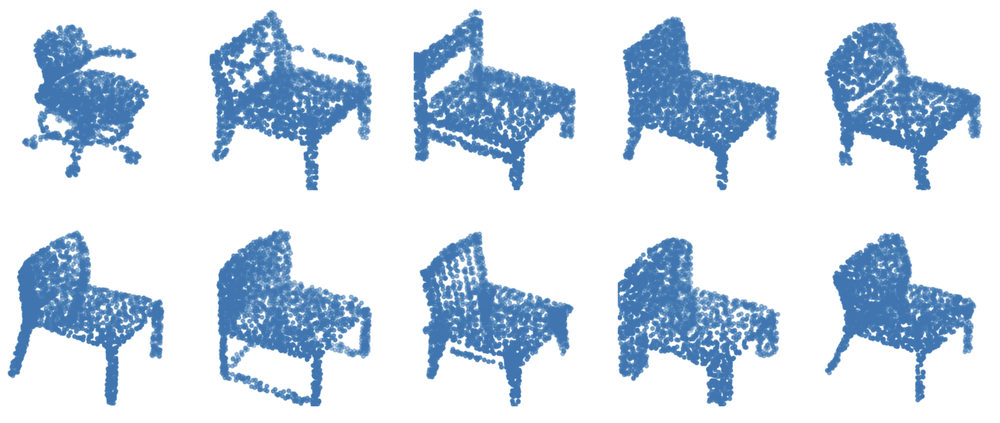

<div align=center>
  <h1>
  🪑 3D Volume Generation
  </h1>
  <p>
    <a href=https://mhsung.github.io/kaist-cs492d-fall-2024/ target="_blank"><b>KAIST CS492(D): Diffusion Models and Their Applications (Fall 2024)</b></a><br>
    Course Project
  </p>
</div>

<div align=center>
  <p>
    Instructor: <a href=https://mhsung.github.io target="_blank"><b>Minhyuk Sung</b></a> (mhsung [at] kaist.ac.kr)<br>
    TA: <a href=https://63days.github.io/ target="_blank"><b>Juil Koo</b></a>  (63days [at] kaist.ac.kr)
  </p>
</div>

<div align=center>
   
   <figcaption>
	  3D chair shapes from the <a href=https://shapenet.org/ target="_blank">ShapeNet</a> dataset. The  <a href=https://shapenet.org/ target="_blank">ShapeNet</a> dataset is a large collection of 3D models spanning various object categories, with the 3D chair category being one of the most popular. It includes thousands of diverse chair models, ranging in style and complexity. These models are typically represented as 3D meshes but can be converted into various different formats: voxel grids or point clouds. In this project, we aim to build a diffusion model sampling 3D shapes represented by voxels.
    </figcaption>
</div>

## Description
This project aims to build a 3D diffusion model, specifically targeting 3D volume diffusion. We train the model using voxel data at a resolution of (128, 128, 128) from the <a href=https://shapenet.org/ target="_blank">ShapeNet</a> chair class. A major challenge will be efficiently handling this high-resolution data within limited VRAM constraints.


## Data Specification
The dataset consists of 2,658 chairs represented by binary voxels, where a value of 1 indicates the object's surface at that position. To obtain the voxel data, we voxelize point clouds from the ShapeNet dataset. Run the following command to preprocess the data:

```
python load_data.py
```

A 3D voxel visualization code is in `visualize.ipynb`.

## Tasks
Your task is to implement a diffusion model that generates 3D voxels. You have the freedom to explore any methods or techniques to handle the hih-resolution data efficiently. After implementing the model, run the evaluaiton code provided and report the results. Below are further details on the evaluation.

## Evaluation
To evaluate the performance of our trained 3D voxel diffusion model, we use the Jensen-Shannon Divergence (JSD) as a similarity measure between the generated samples and the reference set, following Achlioptas et al. [1]. 

The core idea is to treat each 3D voxel set as a probability distribution, where the value at each voxel represents the probability of occupancy. For each voxel set, we first count the number of nonzero values in each voxel across all samples. These counts are then normalized by dividing them by the total number of nonzero points, resulting in a probability distribution that reflects the likelihood of occupancy at each voxel in 3D space. Once both sets are converted into probability distributions, we calculate the Jensen-Shannon Divergence (JSD) to measure the difference between the two distributions, providing a quantification of their similarity.


Sample 2,000 voxels using your model and save them in `.npy` format with a shape of `(2000, 128, 128, 128)`. At the end of the sampling process, discretize the values to either 0 or 1 by applying a threshold, setting the value to 1 if x > 0.5 and to 0 otherwise. Once the data is saved, run the following command to measure JSD:

```
python eval.py {PATH/TO/YOUR_SAMPLE_DATA.NPY}
```

You will get a full credit if your JSD score is lower than 0.3.

## What to Submit
In a single pdf file, report your JSD score as a screenshot and at least 8 visualization of your samples.
Compress your source code and the pdf file into a zip file and submit it.

## Acknowledgement 
The dataset is from <a href=https://shapenet.org/ target="_blank">ShapeNet</a>.

## Reference
[1] [Learning Representations and Generative Models for 3D Point Clouds](https://arxiv.org/abs/1707.02392)
